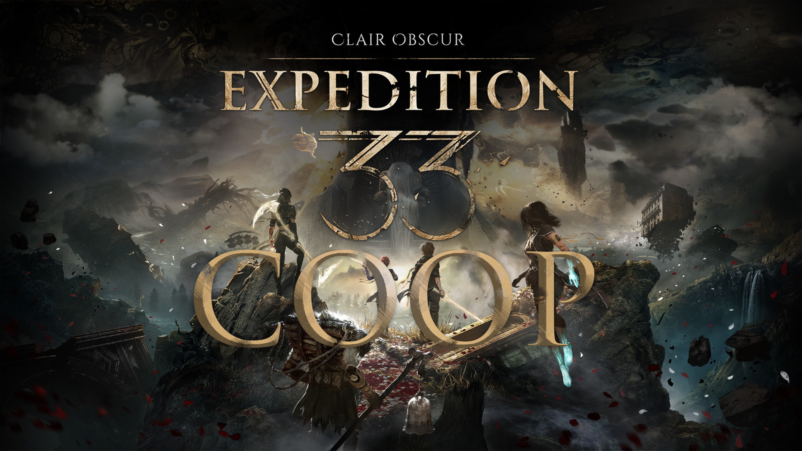

# Expedition 33: Clair Obscur - Coop

For those who come after, with your friends!



## How it works

- During battles each player will control their own character, including having to parry and chose actions.
- During exploration, player 1 will have control by default, but any player can take over by pressing START (useful for leveling and choosing equipment for your own characters)

### Playing with friends remotely

Steam only offers "Remote Play-Together" for games that have built-in coop support, but you can use [RemotePlayWhatever](https://github.com/m4dEngi/RemotePlayWhatever) as a workaround. 

## Installation

Download the latest release and unzip it in the game folder under `..\Expedition 33\Sandfall\Content\Paks\~mods`. 
If the `~mods` folder does not exist, create it.

## Issues

The mod is still in the very early stages, if you experience any issues, please file an issue with an exact description and your save game attached.

## For Developers

### Building

- Clone this repository `git clone https://github.com/Kouzukii/expedition33-coop.git --recurse-submodules`
- Download [retoc](https://github.com/trumank/retoc) into the project root folder.
- Extract the game's assets into the `./Export` folder 
  ```
  .\retoc.exe to-legacy "GAMEPATH\Expedition 33\Sandfall\Content\Paks" ".\Export"
  ```
- Start Unreal Engine 5.4 and open `./Sandfall/Sandfall.uproject`
- Package the project with the Shipping configuration under the `./Sandfall` directory (Such that `./Sandfall/Windows/Sandfall/Sandfall.exe` is created)
- Build the mod using `dotnet run --project Expedition33Coop.csproj` (DotNet SDK 9 is required)